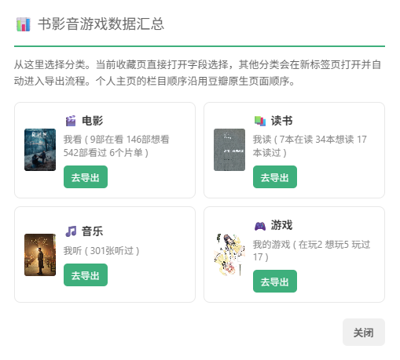
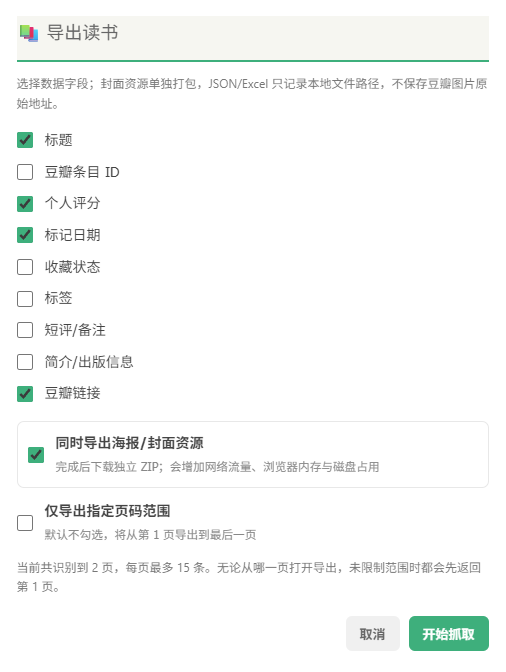
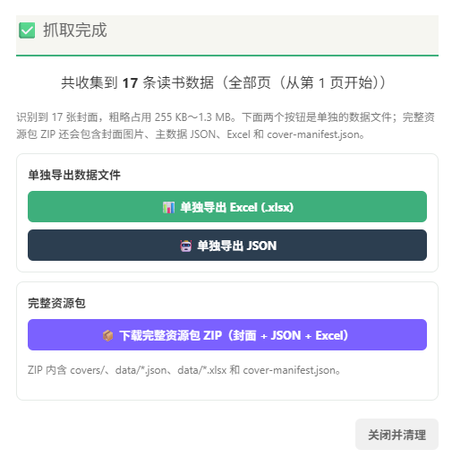
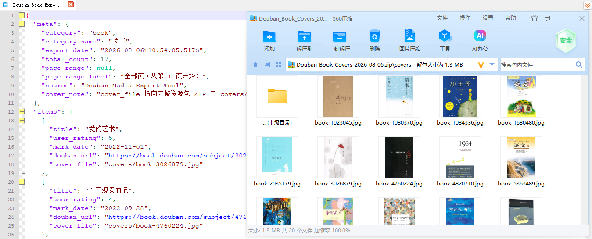

# 豆瓣书影音游戏数据导出工具

  

一个用于备份豆瓣电影、读书、音乐和游戏收藏的油猴（Tampermonkey）脚本，支持 JSON、Excel，以及可选的封面资源包。

## 示例









## 功能

- 支持电影、读书、音乐、游戏四类收藏。
- 支持自定义导出字段、JSON 和 Excel（`.xlsx`）。
- 支持从个人主页的“书影音游戏汇总”入口导航到具体分类。
- 支持指定页码范围；默认导出全部页面，即使从第 2 页打开也不会漏掉前面的记录。
- 可选导出封面，并显示下载数量、空间估算和 ZIP 生成进度。

## 安装

1. 安装 [Tampermonkey](https://www.tampermonkey.net/) 或其他兼容的用户脚本管理器。
2. 打开[脚本安装地址](https://github.com/byJming/douban-movie-exporter/raw/main/douban-movie-exporter.user.js)。
3. 确认安装或更新，并检查脚本版本为 `2.4.0`。

## 使用

登录豆瓣电脑版后，进入个人主页或以下任一收藏页：

- 电影：<https://movie.douban.com/mine?status=collect>
- 读书：<https://book.douban.com/mine?status=collect>
- 音乐：<https://music.douban.com/mine?status=collect>
- 游戏：`https://www.douban.com/people/<你的豆瓣 ID>/games?action=collect`

点击右上角“书影音游戏汇总”，选择分类后配置字段。

页码范围默认不启用；勾选“仅导出指定页码范围”后，填写起始页和结束页即可。页码从 1 开始，范围包含首尾页。

任务完成后，下载选项分为两组：

- **单独导出 JSON / Excel**：只下载数据文件。
- **下载完整资源包 ZIP**：仅在选择封面时出现，包含：

  ```text
  covers/                 封面图片
  data/*.json             主数据 JSON
  data/*.xlsx             主数据 Excel
  cover-manifest.json     封面与条目的关联清单
  ```

## 封面说明

豆瓣图片 CDN 存在防盗链，脚本不会把原始图片链接写入 JSON、Excel 或清单，而是在豆瓣页面上下文中下载实际图片并打包到 ZIP。`cover_file` 是 ZIP 内的本地相对路径；清单中的条目 ID、标题、评分、日期和豆瓣链接用于关联记录。

封面选项默认关闭；不勾选时不会发起图片请求。封面下载最多并发 2 张，超过 200 张会再次确认。

## 注意事项

- 本脚本仅用于个人备份、迁移和学习，请勿高频或商业化抓取。
- 抓取期间不要手动修改收藏状态、排序方式或分页参数。
- 豆瓣页面结构可能调整；如果按钮消失或字段为空，请附页面类型和控制台错误反馈。
- 发布封面或条目内容到个人网站前，请确认用途合规。

## License

MIT License，版权归 ming 所有。联系邮箱：`woqiang0610@163.com`。
